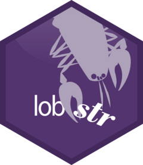

<!-- README.md is generated from README.Rmd. Please edit that file -->

# lobstr 

[](https://cran.r-project.org/package=lobstr)
[](https://travis-ci.org/r-lib/lobstr)
[](https://codecov.io/github/r-lib/lobstr?branch=master)

lobstr provides tool in the same vein as `str()`, tools that allow you
to dig into the detail of an object.

## Installation

You can install the development version with:

``` r
# install.packages("devtools")
devtools::install_github("r-lib/lobstr")
```

## Example

### Abstract syntax trees

`ast()` draws the abstract syntax tree of R expressions:

``` r
ast(a + b + c)
#> █─`+` 
#> ├─█─`+` 
#> │ ├─a 
#> │ └─b 
#> └─c

ast(function(x = 1) {
  if (x > 0) print("Hi!")
})
#> █─`function` 
#> ├─█─x = 1 
#> ├─█─`{` 
#> │ └─█─`if` 
#> │   ├─█─`>` 
#> │   │ ├─x 
#> │   │ └─0 
#> │   └─█─print 
#> │     └─"Hi!" 
#> └─<inline srcref>
```

### References

`ref()` shows hows objects can be shared across data structures by
digging into the underlying \_\_ref\_\_erences:

``` r
x <- 1:1e6
y <- list(x, x, x)
ref(y)
#> █ [1:0x7f9adf16b078] <list> 
#> ├─[2:0x7f9add3d9b48] <int> 
#> ├─[2:0x7f9add3d9b48] 
#> └─[2:0x7f9add3d9b48]

e <- rlang::env()
e$self <- e
ref(e)
#> █ [1:0x7f9ada2fc7e8] <env> 
#> └─self = [1:0x7f9ada2fc7e8]
```

A related tool is `obj_size()`, which computes the size of an object
taking these shared references into account:

``` r
obj_size(x)
#> 680 B
obj_size(y)
#> 760 B
```

### Call stack trees

`cst()` shows how frames on the call stack are connected:

``` r
f <- function(x) g(x)
g <- function(x) h(x)
h <- function(x) x
f(cst())
#> █
#> ├─f(cst())
#> │ └─g(x)
#> │   └─h(x)
#> └─cst()
```
